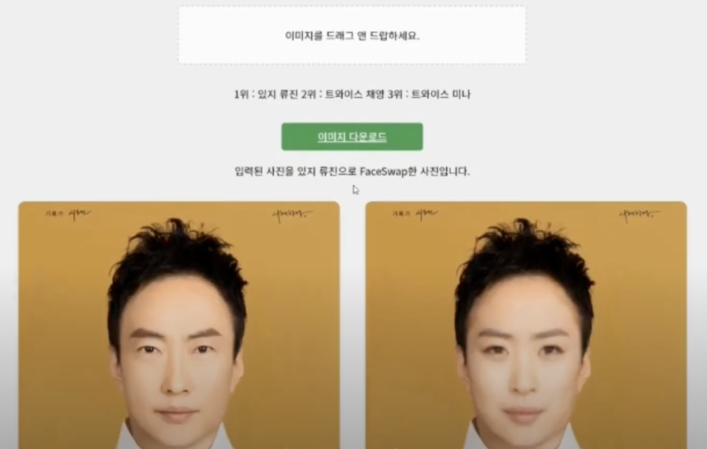

# YeonDalm - AI 얼굴 인식 및 딥페이크 서비스



## 프로젝트 소개
닮은 연예인을 찾고 나의 얼굴을 연예인으로 DeepFake 시켜주는 웹 서비스

**AI Expo KOREA 2023 부스 운영 및 COEX 전시 참가**

## 주요 기능
- **얼굴 인식**: 사용자가 업로드한 이미지에서 얼굴을 인식
- **닮은 연예인 찾기**: 사용자 얼굴과 가장 유사한 연예인 TOP 3
- **얼굴 합성 (DeepFake)**: 사용자 얼굴을 선택된 연예인 얼굴로 자연스럽게 합성
- **이미지 다운로드**: 합성된 이미지 저장 기능

## 기술 스택
- **프론트엔드**: HTML, CSS, JavaScript 
- **백엔드**: FastAPI
- **딥러닝 프레임워크**: PyTorch
- **얼굴 인식 모델**: EfficientNet
- **얼굴 합성 모델**: MobileFaceSwap
- **데이터 수집**: BeautifulSoup(bs4)

## 시스템 아키텍처
YeonDalm은 세 가지 주요 구성 요소로 이루어져 있습니다:

1. **프론트엔드**: 사용자 인터페이스 제공 및 이미지 업로드/결과 표시
2. **AI 서버**: 얼굴 인식 및 닮은 연예인 판별
3. **DeepFake 엔진**: MobileFaceSwap 기반 얼굴 합성 처리

## 개발 과정

### 1. 데이터 수집
- K-POP 아이돌 및 연예인 68명의 얼굴 이미지 데이터 크롤링
- Google 이미지 검색 API를 활용한 자동화된 데이터 수집

### 2. 얼굴 인식 및 학습
- OpenCV 기반 얼굴 검출 및 크롭
- EfficientNet-B0 모델을 활용한 얼굴 특징 학습
- 150 에포크 학습 및 조기 종료(Early Stopping) 적용

### 3. 얼굴 합성 모델 구현
- MobileFaceSwap 논문 기반 모델 적용 (AAAI 2022)
- 얼굴 랜드마크 검출 및 얼굴 정렬 처리
- 자연스러운 얼굴 합성을 위한 마스킹 기법 활용

### 4. 서버 구축
- FastAPI 기반 REST API 서버 개발
- 이미지 처리 및 모델 추론 파이프라인 구축
- CORS 설정을 통한 프론트엔드 연동

### 5. 프론트엔드 개발
- 드래그 앤 드롭 기능으로 사용자 편의성 향상
- 실시간 처리 상태 표시 및 결과 시각화
- 반응형 디자인 적용

## 설치 및 실행 방법

### 필수 환경
- Python 3.7+
- CUDA 지원 GPU (선택사항, CPU에서도 동작 가능)

### 설치

1. 저장소 클론
```bash
git clone https://github.com/teraha-dev/YeonDalm.git
cd YeonDalm
```

2. 의존성 패키지 설치
```bash
pip install -r requirements.txt
```

3. 필요한 모델 다운로드
```bash
# MobileFaceSwap 모델은 아래 위치에서 다운로드
# Google Drive: https://drive.google.com/file/d/1ZIzGLDB15GRAZAbkfNR0hNWdgQpxeA_r/view?usp=sharing
```

4. 모델 파일 위치
```
/faceswap/checkpoints/ 디렉토리에 다운로드한 모델 파일 위치
```

### 실행

1. 서버 실행
```bash
cd server
python main.py
```

2. 웹 서비스 접속
```
웹 브라우저에서 http://localhost:8000 접속
```

## 프로젝트 구조
```
YeonDalm/
│
├── ai/                    # AI 모델 관련 코드
│   ├── crop.py            # 얼굴 검출 및 크롭
│   ├── train.py           # 모델 학습 코드
│   ├── data/              # 데이터셋 저장 디렉토리
│   └── model/             # 학습된 모델 저장 디렉토리
│
├── crawler/               # 데이터 수집 관련 코드
│   └── crawler.py         # 연예인 이미지 크롤링
│
├── faceswap/              # DeepFake 얼굴 합성 관련 코드
│   ├── main.py            # 얼굴 합성 메인 로직
│   ├── models/            # 얼굴 합성 모델
│   ├── utils/             # 유틸리티 함수
│   └── checkpoints/       # 사전 학습된 모델 가중치
│
├── server/                # 백엔드 서버
│   ├── main.py            # 서버 메인 엔트리 포인트
│   ├── app/               # API 라우터 및 서비스 로직
│   ├── core/              # 핵심 기능 및 설정
│   └── utils/             # 유틸리티 함수
│
└── Yeondalm-Frontend/     # 프론트엔드 코드
    ├── index.html         
    ├── style.css          
    └── app.js             
```

## 사용 예시
1. 웹페이지 접속
2. "이미지를 드래그 앤 드롭하세요" 영역에 이미지 업로드
3. 시스템이 자동으로 닮은 연예인 TOP 3 표시
4. 가장 유사도가 높은 연예인으로 얼굴 합성 진행
5. 완성된 이미지는 "이미지 다운로드" 버튼으로 저장 가능

## 한계점 및 향후 개선 방향
- 얼굴 각도 및 조명에 따른 인식률 향상 필요
- 다양한 인종 및 연령대 지원 확대
- 모바일 환경 최적화 및 앱 버전 개발 고려
- 실시간 영상 처리 기능 추가
